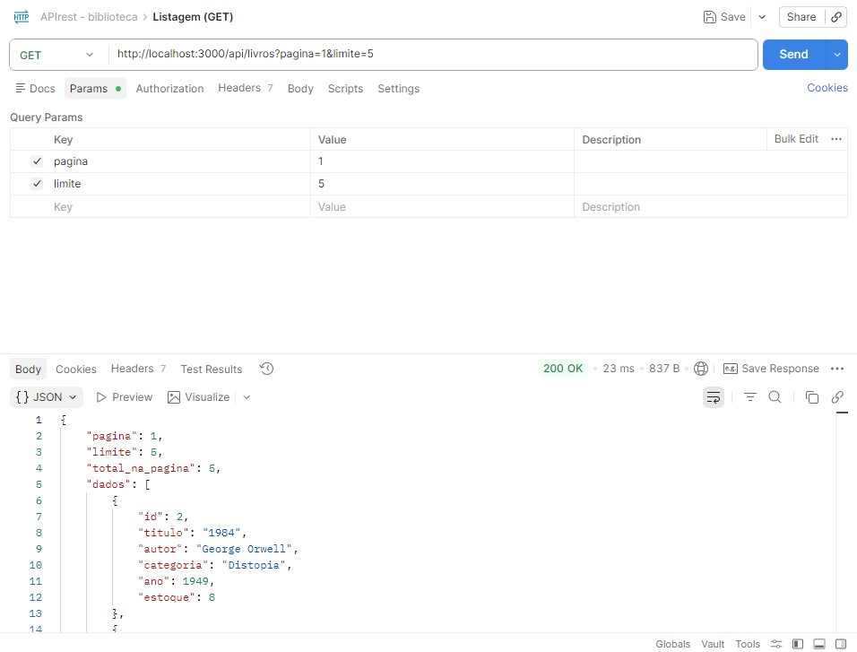
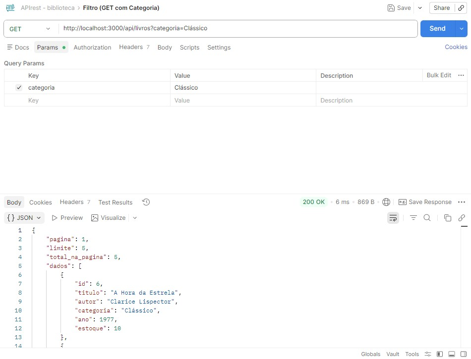
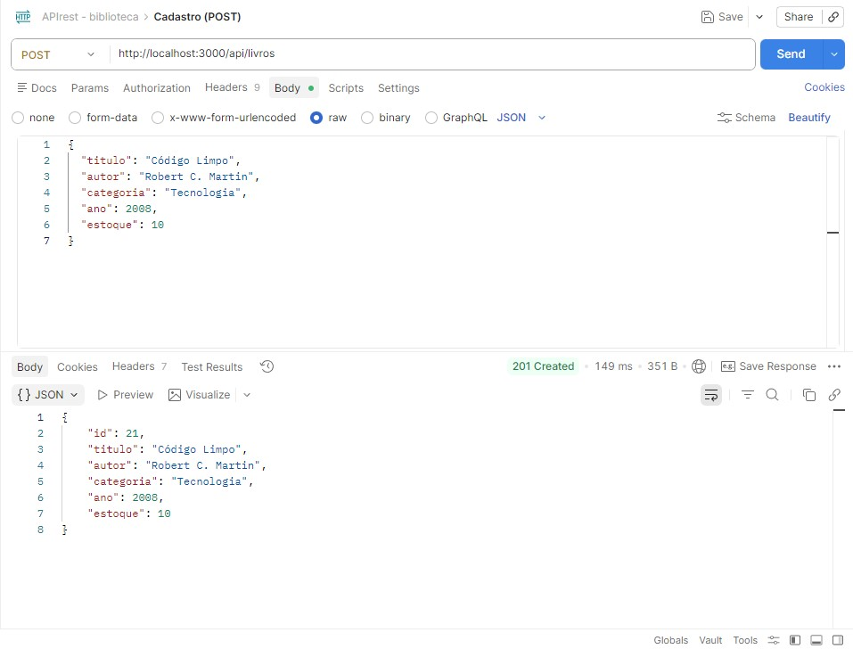
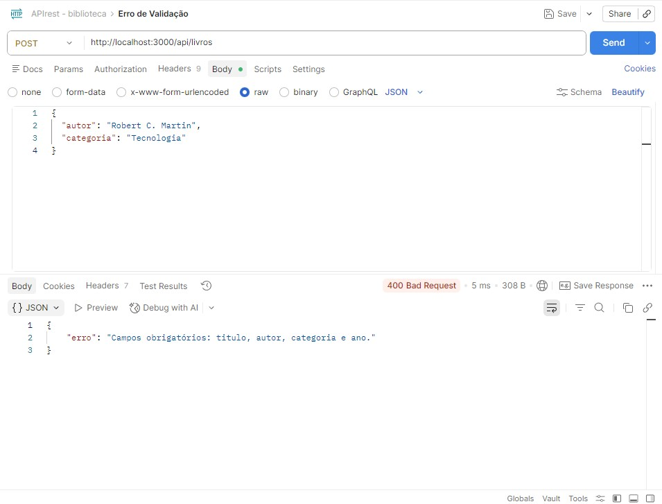
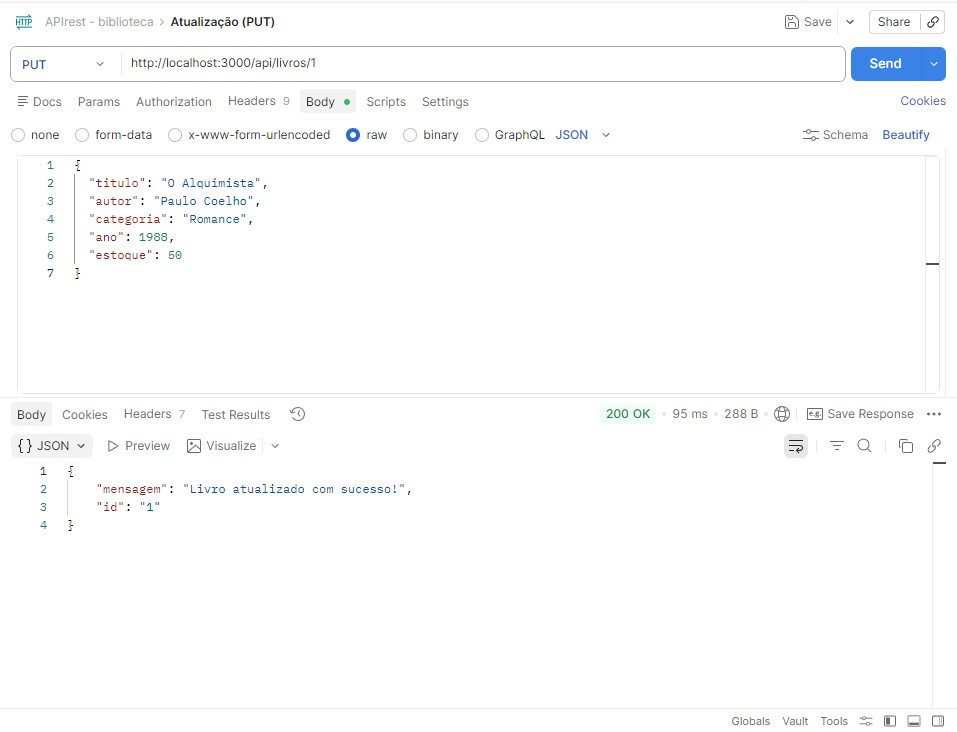
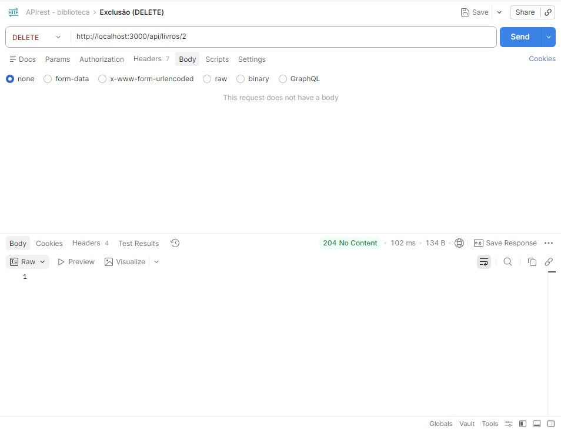

## 📸 Demonstração do Projeto (Evidências de Teste)

Abaixo estão os registros das funcionalidades sendo testadas via Postman, comprovando a persistência no banco de dados SQLite e o funcionamento das rotas.

### 1. Listagem de Livros (GET)
Retorno de todos os registros presentes no banco de dados com suporte a paginação.
 //imagens

### 2. Filtro por Categoria
Exemplo de busca filtrada por uma categoria específica através de Query Params.


### 3. Cadastro de Novo Livro (POST)
Criação de um novo registro com retorno de Status 201 (Created).


### 4. Tratamento de Erros e Validação
Demonstração da API impedindo o cadastro de dados incompletos ou inválidos (Status 400).


### 5. Atualização de Dados (PUT)
Edição de um livro existente filtrado pelo ID na URL.


### 6. Remoção de Livro (DELETE)
Exclusão definitiva de um registro do banco de dados (Status 204).


---
## Como Instalar e Rodar

**Clonar o repositório:**
   ```bash
   git clone https://github.com/jcamargo26/API_bibliotecaFinal.git